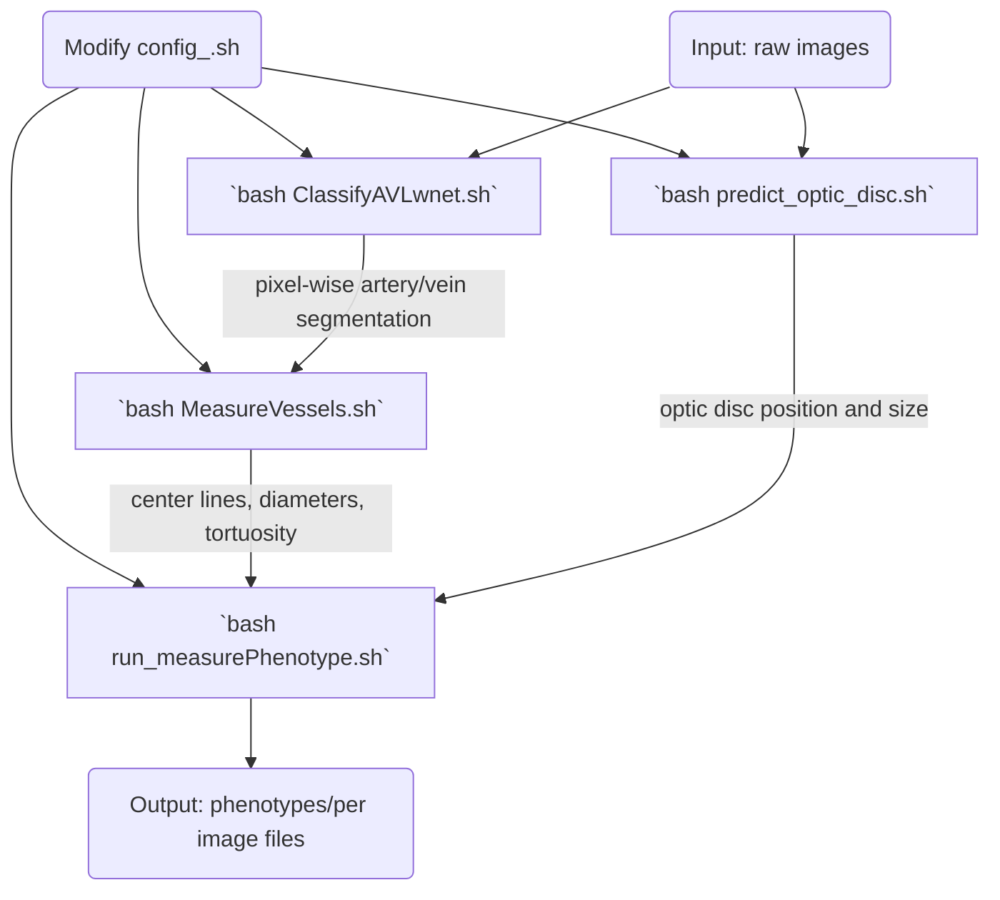

# FROM RETINA IMAGES TO PHENOTYPES  

## Requirements:
* L-WNET (https://github.com/agaldran/lwnet) for the Artery/Vein segmentation
* Matlab license to use ARIA (https://journals.plos.org/plosone/article?id=10.1371/journal.pone.0032435, you do not need to download them, a modified version of it is included on this code) to measure the centerline, diameters, and segments of the vessels (This is not needed if you only want to measure phenotypes that are based purely on pixel-wise segmentation)
* Packages needed: 

## Pipeline:

1- Modify `configs/config_local.sh` and `configs/config_.sh`
Particularly: Define the path of the research repository, and name the RUN.

2 - Run `preprocessing/ClassifyAVLwnet.sh`. 
Output: AV maps for your images.  By default in the folder: `*RUN*/AV_maps`
Code: `bash ClassifyAVLwnet.sh` 

3 - Run `preprocessing/predict_optic_disc.sh`.
Output: Optic disc positions in `*RUN*/optic_disc`
Code: `./predict_optic_disc.sh`

4 - Run `preprocessing/MeasureVessels.sh`. 
Output: Centerlines output.  By default in the folder: `*RUN*/skeletons_etc`
Code: `bash MeasureVessels.sh`

5 - Run `preprocessing/run_measurePhenotype.sh`. 
Output: Trait measurements. By default in the folder: `*RUN*/image_phenotype`
Code: `bash run_measurePhenotype.sh'

Additionally, you can run `example/example_plot_phenotypes.ipynb'. In this Jupiter notebook the vessel we provide all the steps computed until 5 (run_measurePhenotype.py) for some DRIVE examples, so you can see how the measured phenotypes look like.
 
# PHENOTYPES MEASURED 
## Main phenotypes measured:
* Median diameter of all the vessels, only arteries, and only veins ('medianDiameter_all, medianDiameter_artery, medianDiameter_vein')
* Median tortuosity (measured as the Distance Factor) of all the vessels, only arteries, and only veins ('tau1_all, tau1_artery, tau1_vein')
* Central retinal equivalent for arteries and veins ('eq_CRAE, eq_CRVE')
* Ratio between the diameters of the arteries and the diameters of the veins ('ratio_AV_medianDiameter')
* Ratio between the tortuosity of the arteries and the tortuosity of the veins ('ratio_CRAE_CRVE')
* Ratio between the central retinal equivalent of the arteries and the tortuosity of the veins ('ratio_AV_DF')
* Diameter variability of the arteries and veins ('D_A_std, D_V_std)
* Number of bifurcations and branching ('bifurcations')
* Main temporal venular angle and main temporal arteriolar angle ('mean_angle_tva, mean_angle_taa') 
* Vascular density of all the vessels, only arteries, and only veins ('VD_orig_all, VD_orig_artery, VD_orig_vein')
* Ratio between the vascular density of the arteries and the diameters of the veins ('ratio_VD')
* Fractal dimensionality of all the vessels, only arteries, and only veins ('FD_all, FD_artery, FD_vein')

## A more complete list of possible phenotypes can be measured under the following names:
*SUPPLEMENTARY_LABELS= 'tau1_all,tau1_artery,tau1_vein,ratio_AV_DF,tau2_all,tau2_artery,tau2_vein,tau4_all,tau4_artery,tau4_vein, D_std,D_A_std,D_V_std,D_CVMe,D_CVMe_A,D_CVMe_V,bifurcations,VD_orig_all,VD_orig_artery,VD_orig_vein,ratio_VD, FD_all,FD_artery,FD_vein,mean_angle_taa,mean_angle_tva,eq_CRAE,eq_CRVE,CRAE,CRVE,ratio_CRAE_CRVE,ratio_standard_CRE,
medianDiameter_all,medianDiameter_artery,medianDiameter_vein,ratio_AV_medianDiameter'
*SUPPLEMENTARY_NAMES= 'tortuosity,A tortuosity,V tortuosity,ratio tortuosity,tortuosity2,A tortuosity2,V tortuosity2,tortuosity4,A tortuosity4,V tortuosity4, std diameter,A std diameter,V std diameter,CVMe diameter,A CVMe diameter,V CVMe diameter,bifurcations,vascular density,A vascular density,V vascular density,ratio vascular density, fractal dimension,A fractal dimension,V fractal dimension,A temporal angle,V temporal angle,A central retinal eq,V central retinal eq,A central retinal eq2,V central retinal eq2,ratio central retinal eq,ratio central retinal eq2, median diameter,A median diameter,V median diameter,ratio median diameter'

### Some possible errors and reminders:
* LWNET, no image generated in DATASET_AV_maps:   AttributeError: module 'skimage.draw' has no attribute 'circle' . You need "your_python_dir/python -m pip install scikit-image==0.16.2" and python3

* python3 -m pip install --upgrade Pillow

* If you are not familiar with bash scripts and you want to change the code, the spaces are very important!(Avoid when defining variables, and use them for conditions)

##################################################################################################################################################################
